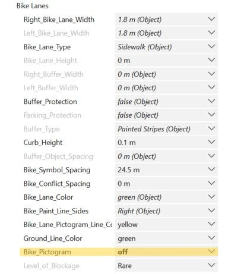
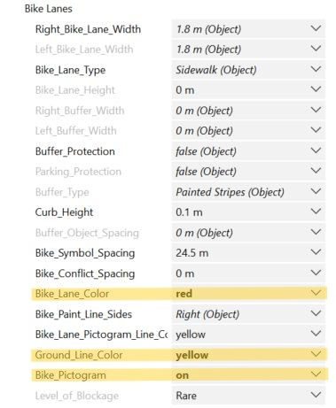

# Complete Street Rule - Changes for Switzerland

``Complete_Street_FHNW.cga`` is the latest version of ``Complete_Street.cga`` with changes to reflect the Swiss road infrastructure.

### Bikelane Pictogram and Side Line
On a width-enough sidewalk, the **Bike Pictogram** is not always represented, to enable this in CityEngine, in the ``Complete_Street.cga`` rule version, the pictogram color where set on **green** (gray). In the new rule ``Complete_Street_FHNW.cga``, the pictogram can be removed properly using an on-off function, and whenever a bike pictogram is represented on bikelanes, they are in switzerland mostly **yellow**. To adapt the new rule to this specificity some changes where done on line(s):
- 271-272: ``Bike_Lane_Pictogram_Line_Color`` (new attribut), enable to control the color of the bikelane side line and the color of the bike pictogram. It can be changed form **white** to **yellow** and is default set on **yellow**.
- 275-276: ``Bike_Pictogram`` (new attribut), enable to turn the pictogram representation **on** or **off**. Standard is the attribut on **on**.
- 2073-2078: ``BikeLaneArrowStencil``, the bike pictogram with an arrow (never used) will take the color defined on ``Bike_Lane_Pictogram_Line_Color``.
- 2080-2089: ``BikeLaneSymbolStencil`` 
    - If ``Bike_Pictogram`` is turned **on** it will be represented with the selected color for  ``Bike_Lane_Pictogram_Line_Color``.
    - If ``Bike_Pictogram`` is turned **off** no bike pictogram will be represented on the bikelane.

|Pictogram ON|Pictogram OFF|Parameters|
|--------------|-------------|----------|
|||

In Switzerland, the bikelanes side lines can be continuous or dashed. Same as the pictogram on the bikelane, they are mostly **yellow**. To enable to represent dashed or continous lines (**yellow** or **white**), several changes where done on line(s):
- 271-272: ``Bike_Lane_Pictogram_Line_Color`` (new attribut), enable to control the color of the bikelane side line and the color of the bike pictogram. It can be changed form **white** to **yellow** and is default set on **yellow**.

|Pictogram/Line White|Pictogram/Line Yellow|Parameters|
|--------------|-------------|----------|
|||

- 273-274: ``Ground_Line_Color``(new attribut), enable to control the color of the spaces in dashed bikelane side lines. The color is per default the same as the color of the bikelane (``Bike_Lane_Color`` -> Background), but can be changed to between **green** (grey), **black**, **red**, **blue**, **yellow** and **white**.
- 2022-2051: ``BikeLaneLines`` defined different cases depending on the bikelane color (``Bike_Lane_Color``). Depending on the ``Bike_Lane_Color``, the lines colors will have the color ``Bike_Lane_Pictograme_Line_color`` and the asphalt will be painted with the ``Ground_Line_Color``.
- 2055-2056: ``BikeLaneLinesCont``, the painted ashpalt color takes the color from ``Bike_Lane_Pictogram_Line_Color``.

|Bikelane Line Yellow/Red|Bikelane Line Yellow/Grey|Parameters|
|--------------|-------------|----------|
|``Bike_Lane_Color`` = Red   ``Ground_Line_Color`` = ``Bike_Lane_Color``   ``Bike_Lane_Pictogram_Line_Color`` = Yellow|``Bike_Lane_Color`` = Red   ``Ground_Line_Color`` = Grey   ``Bike_Lane_Pictogram_Line_Color`` = Yellow||
|||

### Bus Lane Color
In Switzerland, the buslanes on roads are symbolized with **yellow** pictograms and **yellow** continuous line. In order to enable this specificity in CityEngine, changes where done at line(s):
- 236-237: ``Bus_Lane_Pictogram_Line_Color`` (new attribut), determine both the color of the bus pictogram and the color of the separation line with the road. The color is default set on **yellow** but can be changed to **white** if needed.
- 1814-1832: ``Bus_Lane_Texture_Rule``, the asphalt is painted with the color defined on ``Bus_Lane_Pictogram_Line_Color``.
- 1834-1851: ``Bus_Bike_Lane_Texture_Rule`` (where the bus- and the bikelane are on the same lane), the asphalt is painted with the color defined on ``Bus_Lane_Pictogram_Line_Color`` (only for the bus elements). So it's possible to have a **yellow** bus pictogram (and line) with a **white** bike logo.
- 1881-1888: ``Bus_Lane_Stencil``, pictogram color is the same as defined on ``Bus_Lane_Pictogram_Line_Color``.
- 2408-2415: ``Bus_Stop_Stencil``, the pictogram color is the same as defined on ``Bus_Lane_Pictogram_Line_Color``.

|Buslane white|Buslane Yellow|Parameters|
|--------------|-------------|----------|
|||

### Bikelane Height on the Road
When the bikelane is on the road and there is a curb in between, it sould be possible to adapt the bikelane's height in order to have it on the same height as the curb (and sidewalk, if needed). To do so, some changes are to find on line(s):
- 247-248: ``Bike_Lane_Height`` (new attribut), enables the control of the bikelane's height. The height can be set in a range from 0.0 to 0.4 meters. The default height depends on the ``Buffer_Type``:
    - If the buffer is a **Curb Buffer**, **Curb Buffer with Plants**, or **Curb Buffer with Trees**, the bikelane become the same height as the buffer.
    - Else, the bikelane's height is default on **0.0** meter
- 1945-1950: ``LeftBikeLaneExtruded``, the bikelane on the road is extruded (on the y-axis) up to the bikelane's height.
- 1957-1962: ``RightBikeLaneExtruded``, the bikelane on the road is extruded (on the y-axis) up to the bikelane's height.

In order to adapt the curb height (in the case the curb height has not the same height as the sidewalk), some changes are to see at line(s):
- 259-260: ``Curb_Height`` (new attribut), determine the height of the curb buffer on the road. This attribut take per default the same height as the sidewalk (``Sidewalk_Height``), but can be changed in the interval 0.0 to 0.4 meters.

|Bikelane 0.0 m|Bikelane 0.1 m|Parameters|
|--------------|-------------|----------|
|||

### Road-Sidewalk Distance
Between the road and the sidewalk, there is a little space (0.01 meters). This distance is only visible when the bikelane on the road is higher than 0.0 meters. In order the delete this distance, on line 850, the attribut ``Actual_Lane_Width`` where changed, the **-.01** where deleted from the value.

### Sidewalk Direction
For simples one directional bikelane on the sidewalk, it's important that the bikelane on both sides goes in opposite directions, so that the sidewalk have the same direction as the road on his side. To enable this, some changes where done on line(s):
- 3648-3654: ``Sidewalk_Bike_Lane_Loader``, some cases where defined.
    - If the ``sidewalkSide`` is **Right** (``BikeLaneSection``'s direction is **0**), the sidewalk direction is set to **-1**.
    - If the ``sidewalkSide`` is **Left** (``BikeLaneSection``'s direction is **2**), the sidewalk direction is set to **1**.

