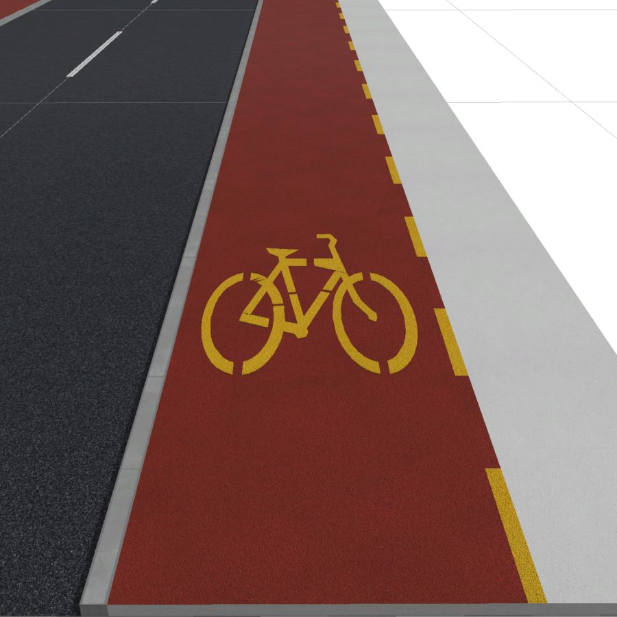
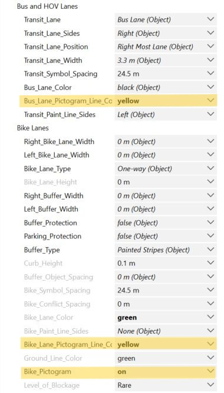
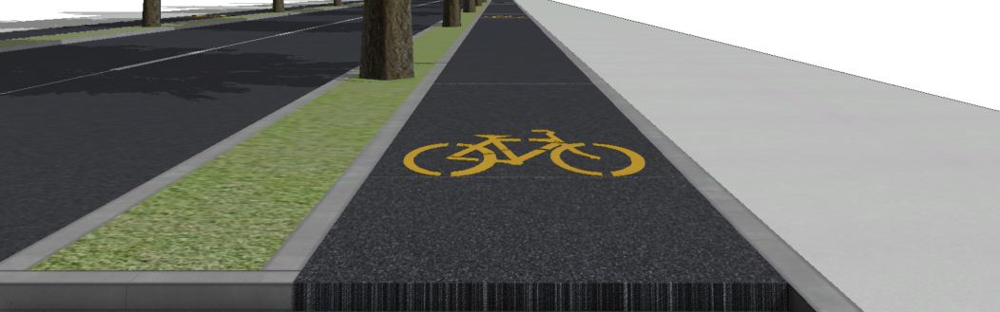

# Complete Street Rule - Changes for Switzerland

``Complete_Street_FHNW.cga`` is the latest version of ``Complete_Street.cga``, with updates reflecting Swiss road infrastructure.

### Shared-use path
On sufficiently wide sidewalks, the **bike pictogram**  is not always represented. To enable this in CityEngine, the original ``Complete_Street.cga`` rule set the pictogram color to **green** (gray). In the new ``Complete_Street_FHNW.cga``rule, the pictogram can now be properly toggled **on** or **off**. When represented, bike pictograms are typically **yellow**in Switzerland. To reflect this, the following changes were made on lines:
- 271-272: ``Bike_Lane_Pictogram_Line_Color`` (new attribute) — controls the color of both the bike lane separator and the bike pictogram. It can be set to **white** or **yellow** (default: **yellow**).
- 275-276: ``Bike_Pictogram`` (new attribute) — toggles the representation of the bike pictogram **on** or **off** (default: **on**).
- 2073-2078: ``BikeLaneArrowStencil`` — the pictogram with an arrow (rarely used) adopts the color from ``Bike_Lane_Pictogram_Line_Color``.
- 2080-2089: ``BikeLaneSymbolStencil`` 
    - If ``Bike_Pictogram`` is **on**, it uses the color defined by ``Bike_Lane_Pictogram_Line_Color``.
    - If ``Bike_Pictogram`` is **off**, no pictogram is displayed on the bike lane.

|Pictogram ON|Pictogram OFF|Parameters|
|--------------|-------------|----------|
|||

In Switzerland, bike lane separators can be continuous or dashed. Like the pictograms, they are typically **yellow**. To represent this in CityEngine, the following changes were made on line:
- 271-272: ``Bike_Lane_Pictogram_Line_Color`` (new attribut)— as above, controls both pictogram and separator colors.

|Pictogram and separator white|Pictogram and separator yellow|Parameters|
|--------------|-------------|----------|
|||

- 273-274: ``Ground_Line_Color``(new attribut) — controls the background color of dashed bike lane separators. Defaults to the same value as ``Bike_Lane_Color`` but can be changed to **green** (grey), **black**, **red**, **blue**, **yellow** and **white**.
- 2022-2051: ``BikeLaneLines`` — defines various cases based on ``Bike_Lane_Color``. The separator uses ``Bike_Lane_Pictograme_Line_color``, and the background uses ``Ground_Line_Color``.
- 2055-2056: ``BikeLaneLinesCont`` — continuous separator uses``Bike_Lane_Pictogram_Line_Color``.

|Dashed separator yellow/red|Dashed separator yellow/grey|Continuous separator yellow|Parameters|
|--------------|-------------|-------------|----------|
|``Bike_Lane_Color`` = Red   ``Ground_Line_Color`` = ``Bike_Lane_Color``   ``Bike_Lane_Pictogram_Line_Color`` = Yellow|``Bike_Lane_Color`` = Red   ``Ground_Line_Color`` = Grey   ``Bike_Lane_Pictogram_Line_Color`` = Yellow|``Bike_Lane_Color`` = Red   ``Ground_Line_Color`` = Yellow   ``Bike_Lane_Pictogram_Line_Color`` = Yellow|
|||||

### Sidewalk direction
For simple, one-directional bike lanes on the sidewalk, it is important that the bike lanes on opposite sides follow opposite directions. This ensures that each sidewalk follows the road direction on its side. To enable this:
- 3648-3654: ``Sidewalk_Bike_Lane_Loader``defines logic.
    - If ``sidewalkSide`` is **right** (``BikeLaneSection`` direction is **0**), sidewalk direction is set to **-1**.
    - If ``sidewalkSide`` is **left** (``BikeLaneSection`` direction is **2**), sidewalk direction is set to **1**.

### Shared bus and bike lane
In Switzerland, bus lanes are marked with **yellow** pictograms and **yellow** continuous separators. To implement this:
- 236-237: ``Bus_Lane_Pictogram_Line_Color`` (new attribute) — defines both the pictogram and separator color (default: **yellow**, optional: **white**).
- 1814-1832: ``Bus_Lane_Texture_Rule`` — paints the asphalt using ``Bus_Lane_Pictogram_Line_Color``.
- 1834-1851: ``Bus_Bike_Lane_Texture_Rule`` — when buses and bikes share the lane, only bus elements use ``Bus_Lane_Pictogram_Line_Color`` , allowing for a **yellow** bus pictogram with a **white** bike pictogram.
- 1881-1888: ``Bus_Lane_Stencil`` — uses ``Bus_Lane_Pictogram_Line_Color``.
- 2408-2415: ``Bus_Stop_Stencil`` — uses ``Bus_Lane_Pictogram_Line_Color``.

|Bus lane white|Bus lane yellow|Bus and bike lane|Parameters|
|--------------|-------------|-------------|----------|
|||||

### Seperated bike lane
When a bike lane is on the road and separated by a curb, it should be possible to raise the bike lane to match the curb height (and optionally the sidewalk height). To support this:
- 247-248: ``Bike_Lane_Height`` (new attribute) — controls the bike lane height, ranging from **0.0** to **0.4** meters. The default height depends on the ``Buffer_Type``:
    - If the buffer is **Curb Buffer**, **Curb Buffer with Plants** or **Curb Buffer with Trees**, the bike lane height matches the buffer.
    - Otherwise, he default height is **0.0** m.
- 1945-1950: ``LeftBikeLaneExtruded`` — extrudes the bike lane to the defined height.
- 1957-1962: ``RightBikeLaneExtruded`` — extrudes the bike lane to the defined height.

To adjust the curb height (when it differs from the sidewalk height):
- 259-260: ``Curb_Height``  (new attribute) — sets the height of the curb buffer. Defaults to the value of ``Sidewalk_Height`` but can range from 0.0 to 0.4 meters.

This allows the curb to be set lower than the sidewalk, at the same height as the bike lane. Previously, curb height was always 0.1 meters, matching the sidewalk.

|Bikelane 0.0 m   Curb 0.1 m|Bikelane 0.1 m   Curb 0.1 m|Bikelane 0.05 m   Curb 0.05 m|Parameters|
|--------------|-------------|-------------|----------|
|||||

### Road-sidewalk distance
There is a small space (0.01 meters) between the road and the sidewalk, which becomes visible only when the bike lane is raised above 0.0 meters. To remove this gap, on line 850, the attribute ``Actual_Lane_Width`` was modified: the **-.01** offset was removed.